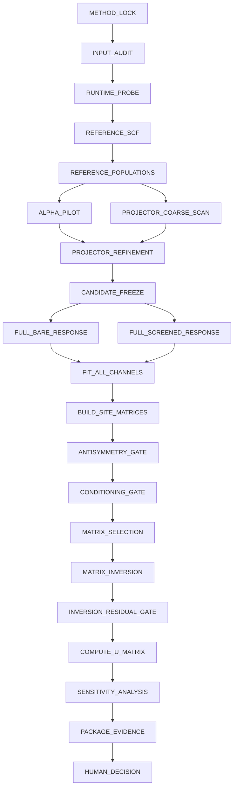

# Especificación del DAG

## Topología lógica



## Parametrización

El DAG se materializa desde cardinalidades declaradas, no desde constantes:

```text
for candidate in candidates:
  for target in perturbation_targets:
    for alpha in candidate.alpha_grid:
      create BARE and SCREENED tasks
```

## Poda

Una rama puede podarse por gate fallido. La poda debe registrar razón y dependencias bloqueadas.

## Reanudación

Los nodos validados pueden reutilizarse sólo si su identidad completa coincide.


## Convenciones normativas

Las palabras **DEBE**, **NO DEBE**, **DEBERÍA**, **NO DEBERÍA** y **PUEDE** son normativas.  
Una regla marcada como DEBE es obligatoria para conformidad. Una regla marcada como DEBERÍA
puede omitirse sólo con una justificación registrada y auditable.
